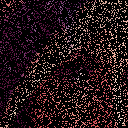

# ADMM Plug and Play
This repository provides a full Pytorch example for ADMM plug and play in the context of image restoration.  
The example ranges from downloading training data and training a CNN denoiser to plugging in the denoiser into ADMM plug and play for a motion deblur and inpainting example.   
[View in Google Colab](https://colab.research.google.com/drive/1XHGdKA-eTvOUwto2jA89z1SEfLTdR-jN?usp=sharing)

|| Degraded | PnP output | Ground truth | 
|-- |--|--|--| 
|Motion deblur| |  |  |
|Inpainting| |  |  |
|Super-resolution| |  |  |
